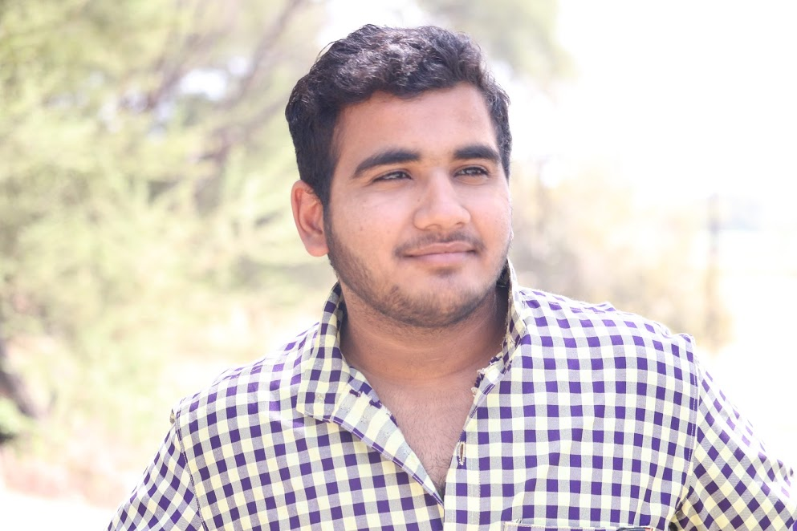

# About me

Hi! I am Maharshi Solanki. I am explorer by heart.

## My background

I am working on IOT projects focusing on pollution and climate change with connection Health. I am also working as Mentor in TechTop Programs which are introducing electonics and making in rural areas for education development. I am currently pursuing 3rd year in Computer Engineering from Gandhinagar Institute of Technology.

## Previous work

I am self Learner and from my first year of my college I have worked with computer networking and hardware assembly. Later I started basic electroincs and 3D printing. My initials basic project are Home security(laser security), water level indicator, wireless charge, fire alarm. Iam currently working on two major Project and One startup Idea.

- Safety Switch for Machines in Makerspaces ( Industrial Product development work given by a company )
        ~In industrial area main accident was happen with Machine from making cure of that i was plan to make RFID key to start & stop machine. It is fully industry safety product.

- NeoAD -Initial its a text printing strip after some struggle, finally I introduce AirText Image is Basically printing through neopixal and working on application which transfer photo to Air Display.

### StartUp Idea

Wireless Charger for Iphone ( My Start up) - Spark
~Spark is my Start up which a wireless charger and its a portable charger and for display it has neopixal indicator for battery and notification