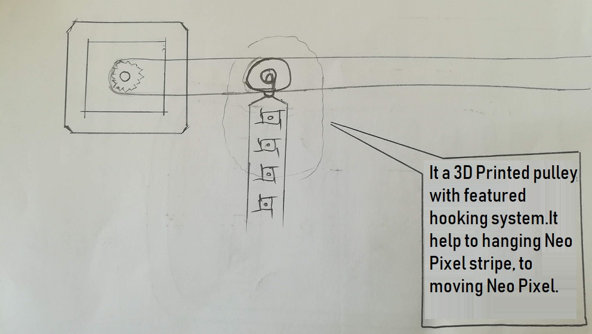

# 1. Principles and practices

This week I worked on defining my final project idea and started to getting used to the documentation process.

# AirText

"Basically its a painting with group of Neo Pixel stripe. It's is work with virtual visual/vision, it will be capture with eye of camera !"

- Normal Picture to Pixelize image
- Era of Digital but work with Analog way

> "I started work on it to make this analog way, for that, I use Neo pixel, controller, network board and started to make something unique which is some intresting and entertainment things."

## Project Initial Sketch

Basic look of my final project

## Project Planning

In my final project, I used a two circuit box with two different supply.

Circuit Box 1 : Power supply ====>  Controller ====> Network Board ====> Neo Pixel

Circuit Box 2: Power supply ====>  Controller ====> Moter controll (It help to move pulley with feature of hooked to hang Neo pixel Strip)

It shows the motor which is connected with the belt who will control the pulley.

It Shows the pulley which hooked a Neo Pixel Strip that is moving through that.

Its a 3D type of view/Isolated sketch of AirText.

## Mobile Interface

For at all try to send image from mobile/Text directly to AirText

Function of each button of application

## Challenges

- compact Controller circuit.
- Controlling speed of motor.
- Upto now I'm done with text but now try with an image.
- Interconnection AirText with mobile interface.
- Try to make application for long shutter click (Now in Android).

## What to fabricate,What to buy!

| Componet      | Fabrication/buy  |
| ------------- |-----------------:|
| Frame         | Laser cutting    |
| Circuit box   | Laser cutting    |
| Pulley        | 3D Printing      |
| Support Wheel | 3D Printing      |
| Hook          | 3D Printing      |
| Circuit       | Fabricate        |
| Motor         | Buy              |
| Neo Pixel     | Buy              |
| Belt          | Buy              |

## Useful links

- [Neo Pixel](https://www.adafruit.com/category/168)
- [Neo Pixal Painting](https://learn.adafruit.com/neopixel-painter/overview)

